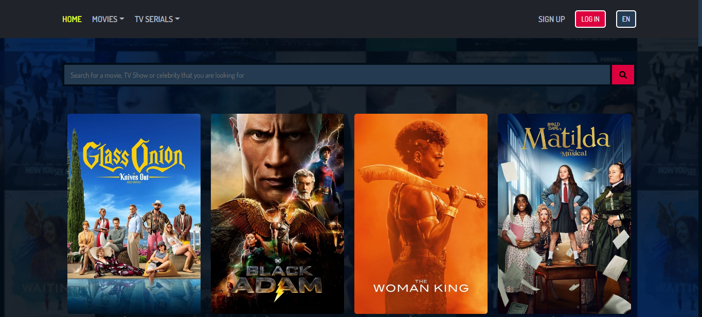
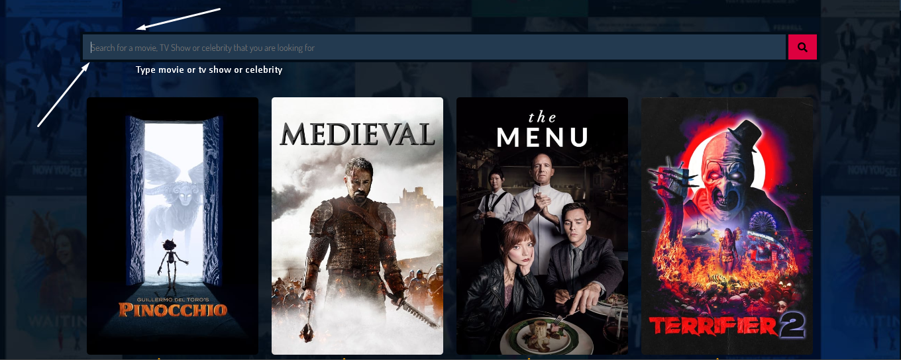
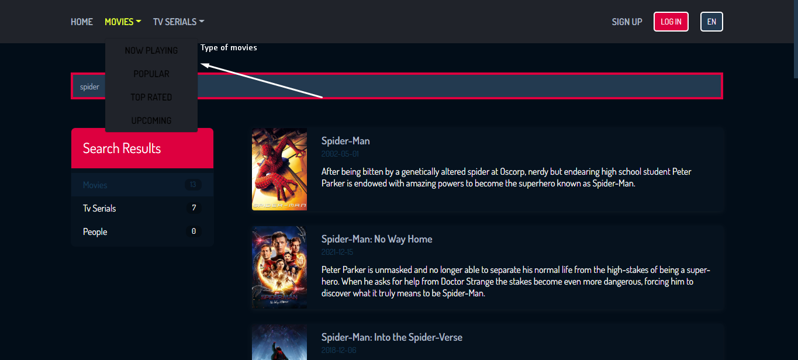
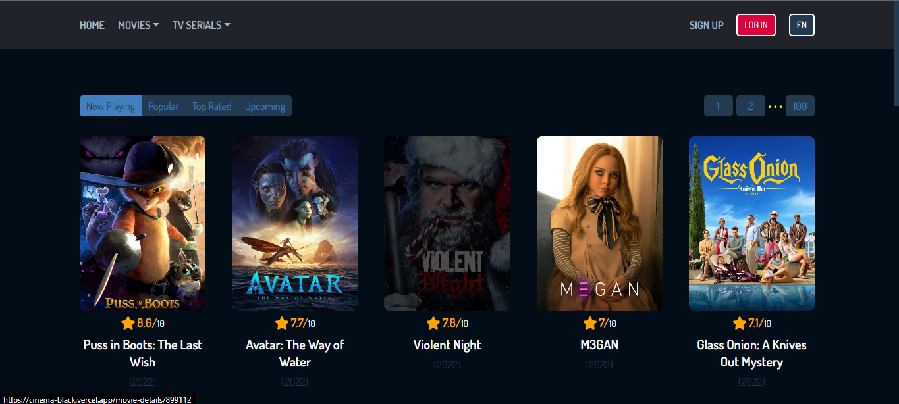
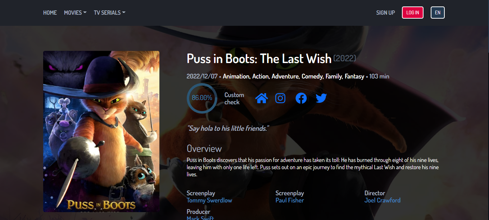
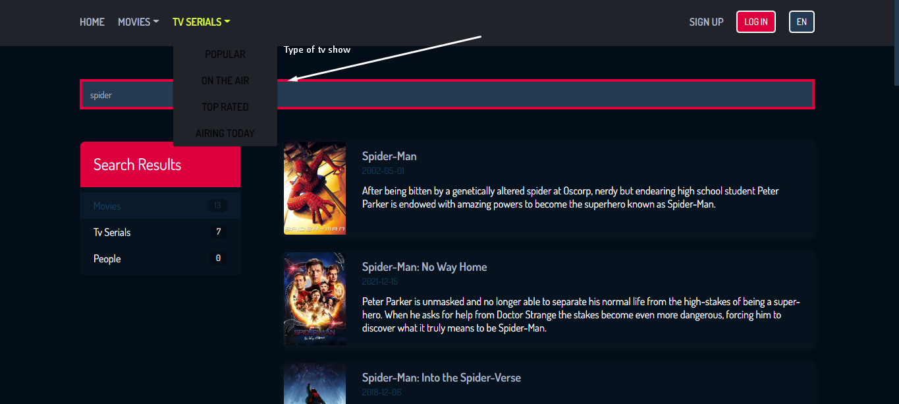
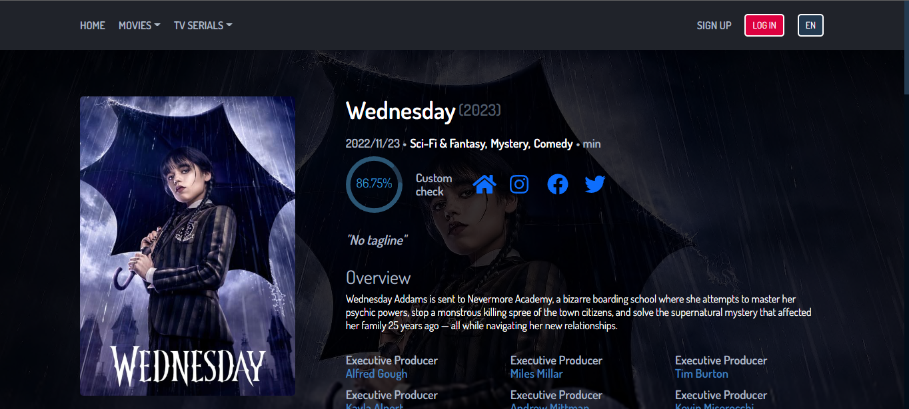
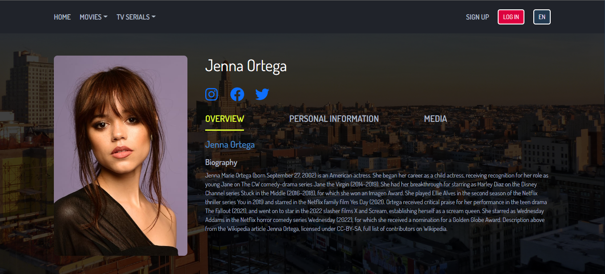

# Cinema

Application for easy viewing of series and movies. Also the actors who participate in the film and series. (Created using TMDB)

---

## Built With

**Client:** React, styled-components, react-router-dom, react-query.

**API:** TMDB API

## Features

- The ability to see information about the series, movie and actor.
- The ability to see all the additional information about the film, series and actor (budget, cast, recommendations, trailers, etc.)
- Sorting movies and series by several types.
- Search for movies, series and actors.
- Support to languages(en & ru)

## Demo

[Demo](https://cinema-black.vercel.app/)

## How To Use

### Main Page

- Main Page, Where you can view everything



- Search input, type movie, tv shows or celebrity



- Search results


### Movies Page

- Movie types



- Movies page



- Movies details



### Tv Shows page

- Tv Show types



- Tv Show details page



### Actors

- Actor details page



## Getting Started

### Installation

1. To run a project locally, first clone the repo

   ```sh
   git clone https://github.com/sapar6ek0v/cinema.git
   ```

2. Go to the project directory

   ```sh
   cd cinema
   ```

3. Install all packages

   ```sh
   npm install
   ```

### Environment Variables

To run this project, you will need to add the following environment variables to your .env file

`API_KEY`

You can get API_KEY here [TMDB docs](https://developers.themoviedb.org/3/getting-started/introduction)

4. Run the project

   ```sh
   npm start
   ```

## Feedback

If you have any feedback, please reach out to me at eldiiarsparbekov03@gmail.com
